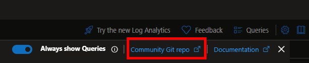
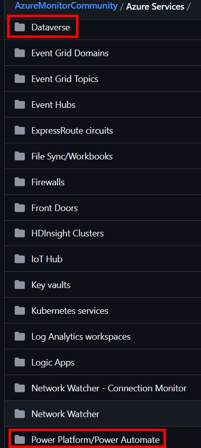
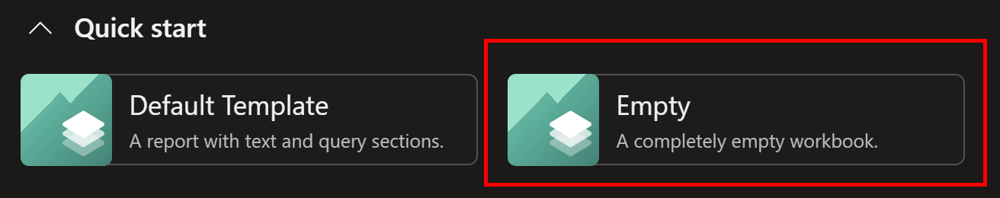
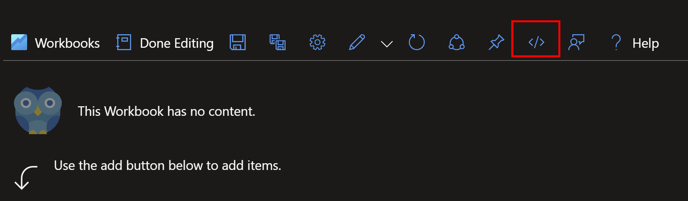
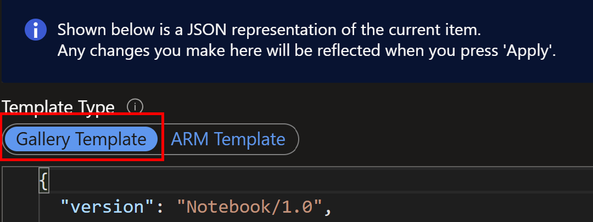
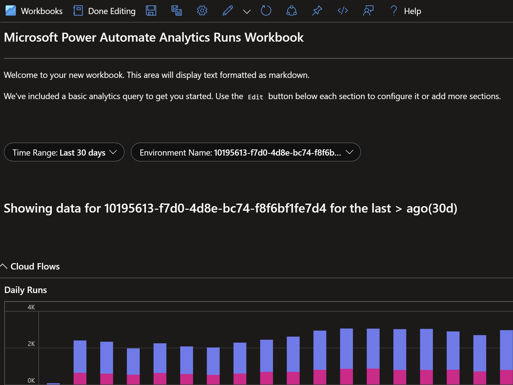

# Monitoring the Power Platform: Azure Monitor Community Artifacts

## Summary

**Monitoring the Power Platform is essential to every successful implementation.** Considering how the platform is used and built upon, monitoring is key to understanding usage and realizing investment value. Power users **improving productivity for daily tasks**. Professional developers building **business critical workloads**. Luckily, many opportunities exist to monitor and alert **increasing reliability and user satisfaction**.

This article is aimed to introduce you to queries and other artifacts publicly available for use. First, we will explore the importance of monitoring **tying the original Monitoring the Power Platform series with the Power Platform Well-Architected Framework**. Next, I'll cover **where the repository is located and how to access it**. I'll then go into the two areas this article is focused on, **Dataverse and the Power Platform monitoring artifacts**. Finally, **we go step by step setting up an initial Azure Workbook for Power Automate telemetry**.

## Why and How to Monitor
[Review the previous guidance detailing the importance of Continuous Monitoring.](../docs/01.01%20-%20Monitoring%20the%20Power%20Platform%20Introduction.md#why-and-how-to-monitor) Within that guidance, you'll find a quote by Alexandre Polozoff that is still relevant. In fact, since the original release of the Monitoring the Power Platform series, **a new set of documentation has been released**. This documentation, called **the Power Platform Well-Architected Framework [explores monitoring in the *Reliability* pillar](https://learn.microsoft.com/en-us/power-platform/well-architected/reliability/monitoring-alerting-strategy)**. I encourage you to read this guidance and take the content in this article **to quickly get started with helpful artifacts**.

How to begin monitoring has been [covered in depth in multiple articles in this series](../docs/01.01%20-%20Monitoring%20the%20Power%20Platform%20Introduction.md) and [my YouTube channel](https://www.youtube.com/channel/UC2gUZlDx50UbOxNVTnIGz8w). Enabling Application Insights for Dataverse, [adding instrumentation to Power Apps Canvas Apps](https://www.youtube.com/watch?v=ZajMP2eLnpw&list=PLtQtmfRDxadM5j_yrSDuh-yFAfl0s3MkE&index=3) and [building a monitoring strategy for Power Automate](../docs/05.03.03%20-%20Monitoring%20Power%20Automate%20-%20Run%20Time%20-%20Implementing%20a%20Monitoring%20Strategy.md). Since the initial articles, advancements have been made. I'll update the original articles with revisions and write new articles based on these changes.

### YouTube - Power Platform Well-Architected Framework - Defining a Monitoring Strategy (2023)

[](https://www.youtube.com/watch?v=AvoD66ItJv4 "Power Platform Well-Architected Framework - Defining a Monitoring Strategy")

## The Azure Monitor Community
**The Azure Monitor Community represents a central repository for monitoring resources in Azure.** Within, you'll find **hundreds of artifacts including queries, workbooks, dashboard and alerts**. The repository is **open source and welcomes contributions from the community**. To access the repository, you can click on the *Community Git repo* button in the upper right hand corner of the Query Designer or click [here](https://github.com/microsoft/AzureMonitorCommunity).



Within the repository, click on the Azure Services folder to access artifacts for [Dataverse](https://github.com/microsoft/AzureMonitorCommunity/tree/master/Azure%20Services/Dataverse) and the [Power Platform](https://github.com/microsoft/AzureMonitorCommunity/tree/master/Azure%20Services/Power%20Platform).



## Dataverse Artifacts Overview
In the Dataverse folder you'll find **samples for queries and dashboards**. The queries are split into categories focused on **scenarios like performance, throttling, exception monitoring, etc.** Most queries include parameters that can be used to **dynamically adjust the look back period.**

Let's look at an example below. 
*NOTE: The official reference is located [here](https://raw.githubusercontent.com/microsoft/AzureMonitorCommunity/master/Azure%20Services/Dataverse/Queries/API%20Activity/Power%20Platform%20Admin%20Center%20Analytics%20-%20Most%20Used%20Entities.kql). Please refer to it for the most up to date example.*

```
// Author: aliyoussefi
// Display name: Power Platform Admin Center - Total Operations by Entity
// Description: This chart shows how many operations (create, update, deletes, reads) have occurred in the environment with a Dataverse database grouped by table over the specified time.
// Categories: Dataverse
// Resource types: Dataverse
// Topic: Usage
dependencies
| where timestamp between (_fromStartTime .. _toEndTime)
| where user_Id != "00000000-0000-0000-0000-000000000000"
| where isempty(operation_SyntheticSource)
| where type in  ("SDKCreate", "SDKUpdate", "SDKRetrieve", "SDKDelete")
| summarize sumDimension = count() by name, type
| top 10 by sumDimension
```
In this example, we are summarizing the amount of Creates, Updates, Reads and Deletes per table. The timestamp uses parameters and the between function to limit the look back period. The query above attempts to reduce the noise from system activities with the user_id filter. This can be removed for a full picture of all CRUD operations. Finally, the query limits the result to the top 10 most active tables. This can also be removed if needed.

Each query found within the Azure Monitor Community repository can be modified and saved within your organization's Azure Log Analytics or Azure Application Insights instance. If saved, **I recommend tagging the queries based on the category and resource types shown above.**

For more information on monitoring Dataverse, please review the [Dataverse for Analytics](./03.01%20-%20Monitoring%20Model%20Driven%20Apps%20-%20Dataverse%20for%20Analytics.md) article.

## Power Platform Artifacts Overview
In the Power Platform folder, you'll find sub folders for each service. Out of the box, at the time of this writing, Microsoft provides native functionality to add monitoring to Power App Canvas Apps, Power Automate, Power Pages and Microsoft Copilot Studio.

Click these links for further examples and deep dives into monitoring [Power App Canvas Apps](./02.04%20-%20Monitoring%20Canvas%20Apps%20-%20Getting%20Started%20with%20Application%20Insights.md) and [Power Automate](./05.03.04%20-%20Monitoring%20Power%20Automate%20-%20Getting%20Started%20with%20the%20Out%20of%20the%20Box%20Power%20Automate%20Telemetry.md).

Let's take a look at an example for the out of the box Power Automate monitoring capability.

```
// Author: aliyoussefi
// Display name: Display cloud flow runs with direct link
// Description: Display all cloud flow runs with a direct link to the cloud flow run for troubleshooting
// Categories: Power Platform
// Resource types: Power Automate
// Topic:  Troubleshooting

requests 
| where customDimensions.resourceProvider == 'Cloud Flow'
| extend data = todynamic(tostring(customDimensions.Data))
| project timestamp, operation_Id,  operation_ParentId, duration, customDimensions.signalCategory, name, data.FlowDisplayName, data.tags.xrmWorkflowId , data.tags.createdBy, 
data, customDimensions, directlink=strcat("https://make.powerautomate.com/environments/", data.tags.environmentName, "/flows/",  name, "/runs/", operation_Id)
```

This example looks at the requests table in Azure Application Insights. The out of the box configuration sends **each flow run to the *requests* table**. **Actions performed for each flow can be found in the *dependencies*** table.
This example filters the provider to *'Cloud Flow'*. It extends the data from in the custom dimensions to **display information about the flow**. This includes the **Xrm Workflow Id**, a **link to the specific flow run** and operation **identifiers that can be used for correlating actions**.

## Building Dashboards for Analyzing Telemetry
At this point, if you are familiar with Azure Application Insights and Log Analytics, the same tools apply as with any other resource. [Power BI Dashboards](https://learn.microsoft.com/en-us/azure/azure-monitor/logs/log-powerbi), [Azure Dashboards](https://learn.microsoft.com/en-us/azure/azure-monitor/app/overview-dashboard), [Azure Workbooks](https://learn.microsoft.com/en-us/azure/azure-monitor/visualize/workbooks-overview), [Azure Data Explorer](https://learn.microsoft.com/en-us/azure/data-explorer/query-monitor-data) dashboards are all available. Artifacts exist in the Azure Monitor Community repository for most of these platforms. 
### YouTube - Power Platform Well-Architected Framework - Monitoring Tools and Scenarios (2023)

[](https://www.youtube.com/watch?v=bXs57Zk7vjY "Power Platform Well-Architected Framework - Monitoring Tools and Scenarios")

Depending on how you plan to analyze may help decide which platform(s) to use. Asking questions like "Who is the primary audience?" If its support teams working directly in Azure, maybe Azure Dashboards and Workbooks are the best option. If the question is related to real or near real time refreshing of dashboards maybe Azure Data Explorer or Microsoft Power BI are a better fit.

### A Power Automate Workbook Example
[Here's an example](https://raw.githubusercontent.com/microsoft/AzureMonitorCommunity/master/Azure%20Services/Power%20Platform/Power%20Automate/Workbooks/Microsoft%20Power%20Automate%20Analytics%20Runs%20Workbook.workbook) of a Azure Workbook designed to look similar to the Power Automate Analytics found [here](../docs/02.01%20-%20Monitoring%20Power%20Automate%20-%20Power%20Automate%20Analytics.docx). **The benefit with this workbook is that it can be drilled into down to the individual flow run and the actions happening within.**

The definition for the workbook is too long for this article but I'll provide some steps to quickly implement.
1. Start by **creating a new workbook**. This is done in the Azure Application Insights resource using the left hand blade.




2. A new workbook designer window will open. Navigate to the code view by **clicking the "< / >" button on the right hand side of the toolbar**.



3. On the left, **toggle the Gallery Template** and insert the code from the repository.



4. **Click Apply** and verify the workbook is loading as expected.




## Next Steps

In this article we have covered getting started with the **Azure Monitoring Community repository for Dataverse and Power Platform artifacts**. Each offers **unique artifacts to help administrators report and take action on key data points**. 

We have also **aligned these artifacts and other documentation within the Monitoring the Power Platform series to a Well-Architected Framework** for both Dataverse and the Power Platform. **Follow up articles will focus on each of these pillars** of the Power Platform and techniques to build dashboards and alerts. This will open up **opportunities for subscribing to critical events and workloads**. This will also align to a [highly reliable platform](https://learn.microsoft.com/en-us/power-platform/well-architected/reliability/). 

If you are interested in learning more about [**specialized guidance and training** for monitoring or other areas of the Power Platform](https://pfedynamics.wordpress.com/2023/09/26/power-platform-and-dynamics-365-service-offerings/), which includes a [monitoring workshop](https://pfedynamics.wordpress.com/wp-content/uploads/2023/09/activatepowerplatformadminenglish.pdf), please contact your **Microsoft representative** for further details. 

Your feedback is **<u>extremely valuable</u>** so please leave a comment below and I'll be happy to help where I can! Also, if you find any inconsistencies, omissions or have suggestions, [please go here to submit a new issue](https://github.com/aliyoussefi/MonitoringPowerPlatform/issues).

## Index

[Monitoring the Power Platform: Introduction and Index](./01.01%20-%20Monitoring%20the%20Power%20Platform%20Introduction.md)